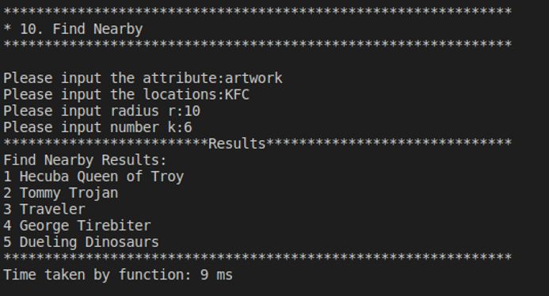
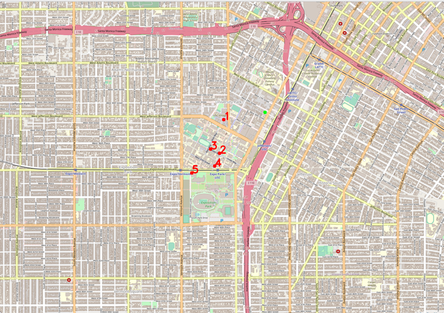

# EE538 Final Project - Fall 2022 - TrojanMap (Lei Suo, Fei Wu)
## Item 1: Autocomplete The Location Name (Phase 1)
This item is used to complete the name of the location with the prefix of the location names. The result is case sensitive. The empty will be return when input empty.

#### 1. Data structure:  
```shell
- std::vector<string> results;  
    Return the vector of matched location names
```
#### 2. Description of function and its time complexity.  
Autocomplete: complete the location names automatically. 
              complexity: O(n), n is the size of the data.
  
#### 3. Example:
Example:

```shell
**************************************************************
* 1. Autocomplete                                             
**************************************************************

Please input a partial location:C
*************************Results******************************
Chinese Street Food
Chase
Cognoscenti Coffee Roastery
Chucks Chicken & Waffles
Cheebos Burger
Cindys Shoes
Cosmo Plaza
Corwin Denney Research Center
Central Church of Seventh Day Adventists
Callejon All Star
Chevron
Chase Plaza Heliport
CAVA
California Family Pharmacy
Community of Christ
Chipotle
Chevron 2
Cover the Homeless Ministry
Church of Christ
CVS Pharmacy
City Tacos
Chevron 1
Central Adult Senior High
Carson Center
Chick-fil-A
Crosswalk
CorePower Yoga
City of Angels Independent Studies School
Cal Mart Beer & Wine Food Store
Crosswalk 1
**************************************************************
Time taken by function: 40 ms
```

## Item 2: Find the Location (Phase 1)
### Item 2-1: Find the place's coordinates in the Map (Phase 1)
Given a location name, return the latitude and longitude. There are no duplicated location names. You should mark the given locations on the map. If the location does not exist, return (-1, -1). The algorithm is case-sensitive.

### Item 2-2: Check Edit Distance Between Two Location Names (Phase 2)
When entering a location name that does not exist in the map, your program should determine whether the input can be replaced with a "similar name" or not. By "similar names" we mean the names that exist in the map with a *smallest distance* from the original input. 

#### 1. Data structure:  
```shell
- std::pair<double, double> results;(2-1)  
    Return the vector of matched location names
 ```
 
#### 2. Description of function and its time complexity.  
GetPosition: get the position of the specific location.   
             complexity: O(n), n is the size of the data.  
CalculateEditDistance: calculate the edit distance of the two string.               
                       complexity: O(n * m), n\m is the length of the input string.  
#### 3. Example:
Example:
```shell
**************************************************************
* 2. Find the location                                        
**************************************************************

Please input a location:tarhet
*************************Results******************************
No matched locations.
Did you mean Target instead of tarhet? [y/n]y
Latitude: 34.0257 Longitude: -118.284
**************************************************************
Time taken by function: 23 ms
```

## Item 3: Get All Categories (Phase 2)
Print all available categories among all existing categories in the map. There should be no duplicates in the output.
#### 1. Data structure:  
```shell
- std::set<std::string> set_categories;  
    a set containing all the catagories and including no duplication of the category names  
```
#### 2. Description of function and its time complexity.  
GetAllCategories: print all the categories.   
                  complexity: O(n), n is the size of the data.
  
#### 3. Example:
Example:
```shell
**************************************************************
* 3. Find all location categories                             
**************************************************************

*************************Results******************************
"artwork", "attraction", "bakery", "bank", "bar", "beauty", "beverages", "bicycle", "bicycle_rental", "bus_station", "cafe", "car", "car_repair", "car_wash", "charging_station", "childcare", "clinic", "clothes", "confectionery", "convenience", "copyshop", "dentist", "department_store", "driving_school", "fabric", "fast_food", "food_court", "fountain", "fuel", "gallery", "hairdresser", "hospital", "hotel", "library", "marketplace", "mobile_phone", "museum", "music", "optician", "parcel_locker", "parking", "parking_entrance", "pharmacy", "place_of_worship", "police", "post_box", "post_office", "restaurant", "school", "shoe_repair", "shoes", "skate", "social_facility", "supermarket", "theatre", "tobacco", "yes", "yoga", TrojanMap Menu
**************************************************************
```


## Item 4: Get All Locations In A Category (Phase 2)
In this section if the user entries a category, the program prints all locations that match that category. 
#### 1. Data structure:  
```shell
 -  std::vector<std::string> res;  
    vector contains all the locations under specific category  
```  
#### 2. Description of function and its time complexity.  
GetAllLocationsFromCategory: print all locations of the specific categories.   
                             complexity: O(n), n is the size of the data.  
  
#### 3. Example:
Example 1:
```shell
**************************************************************
* 4. Get all locations in a category                           
**************************************************************

*************************Results******************************
Please input the category:artwork
"2305853438", "4399693645", "6813379578", "4536993737", "5237417648", TrojanMap Menu
**************************************************************
```
Example 2:
```shell
**************************************************************
* 4. Get all locations in a category                           
**************************************************************

*************************Results******************************
Please input the category:bar
"6045038065", "5567714035", "6045035789", TrojanMap Menu
**************************************************************
```


## Item 5: Get Locations Using A Regular Expression (Phase 2)
In this section, enter a regular expression, return all location ids that match that regular expression.
The program should also verify if the input regular expression was correct. Return an empty vector if the regex is not valid or matches no items.
#### 1. Data structure:
```shell
- std::vector<std::string> ids;  
    vector contains all the id number of the location matching with the input regular expression  
```
#### 2. Description of function and its time complexity.  
GetLocationRegex: print all ids of the locations whose names are matching with given the regular expression. 
                  complexity: O(n), n is the size of the data.
  
#### 3. Example:
```shell
**************************************************************
* 5. Get locations using a regular expression                 
**************************************************************

*************************Results******************************
Please input your regular expression:Ra.?ph.+
"2578244375", TrojanMap Menu
**************************************************************
```

## Item 6: CalculateShortestPath between two places (Phase 2)
#### CalculateShortestPath_Dijkstra
```shell
pseudo code:   
 choosing a node as the start;  
 set all the nodes as unvisited and the distance to the start node is MAX except the start node is 0;  
 while(there is node still not been visited){  
      choose a node from the visited node and calculate the distance of all its neighbor nodes to the start node;  
      compare the calculate result with the storing result and decide whether to update the distance;  
      choose the calculated but unvisited nodes with shortest distance and mark it as a visited node;  
    }  
 after the loop, get the shortest path and add the start node at the end of the node to generater the cycle shortest path.  
```
#### 1. Data structure:  
```shell
- std::priority_queue <std::pair<double,std::string>,
                         std::vector<std::pair<double,std::string>>,
                         std::greater<std::pair<double,std::string>>> min_dist;  
    <distance, id> using piority_queue to set the node with the shortest distance at the begining of the queue
- std::unordered_map <std::string,double> dist;  
    from start to thte current location
- std::unordered_map <std::string,std::string> calculated_loca;  
    record the id of the calculated location
- std::unordered_map <std::string,bool> assigment; 
    record whether the location where have been assigned the distance
```
#### 2. Description of function and its time complexity.  
CalculateShortestPath_Dijkstra: Calculate the shortest path between two locations. O(n * logn), n is the number of nodes.  


#### CalculateShortestPath_Bellman_Ford  
```shell
pseudo code: 
 for each vertex v in vertices do   
        distance[v] := inf             // Initialize the distance to all vertices to infinity   
        predecessor[v] := null         // And having a null predecessor   
    distance[source] := 0              // The distance from the source to itself is, of course, zero   
    
    repeat |V|−1 times:
         for each edge (u, v) with weight w in edges do  
             if distance[u] + w < distance[v] then  
                 distance[v] := distance[u] + w  
                 predecessor[v] := u  
```
#### 1. Data structure:  
```shell
- std::map<std::string, double> distance  
    Map the id to distance.  
- std::map<std::string, std::string> parent  
    Map the current id to its parent id.  
```
     
#### 2. Description of function and its time complexity.  
CalculateShortestPath_Bellman_Ford: Calculate the shortest path between two locations. O(m * n), n is the number of nodes, m is the number of edges.  


#### 3. Example:
Examples :
```shell
**************************************************************
* 6. CalculateShortestPath                                    
**************************************************************

Please input the start location:Target
Please input the destination:Chick-fil-A
*************************Dijkstra*****************************
*************************Results******************************
"5237417650","6814769289","6813379584","6813360961","6813379480","6813360960","6814620882","6813360954","6813360952","6813379420","6813360951","6813360936","6813379467","6813379466","6813379465","6813379464","3402887075","6813379432","4536989637","4536989640","3443310465","6813379491","6818390136","3433701978","4536989636","3432332948","6814770351","3431300454","4536993735","6814770342","2776870272","5580882852","6814770345","2776870269","1472141961","5580883117","123153544","1673645147","2738332818","1673644724","2738332817","122844997","5580881629","4399697303","4399697301","4399697300","6813379550","6814916523","1732243620","4015372469","4015372463","6819179749","1732243544","6813405275","348121996","348121864","6813405280","1472141024","6813411590","216155217","6813411589","1837212103","1837212101","6814916516","6814916515","6820935910","4547476733",
The distance of the path is:0.76522 miles
**************************************************************
Time taken by function: 147 ms

*************************Bellman_Ford*************************
*************************Results******************************
"5237417650","6814769289","6813379584","6813360961","6813379480","6813360960","6814620882","6813360954","6813360952","6813379420","6813360951","6813360936","6813379467","6813379466","6813379465","6813379464","3402887075","6813379432","4536989637","4536989640","3443310465","6813379491","6818390136","3433701978","4536989636","3432332948","6814770351","3431300454","4536993735","6814770342","2776870272","5580882852","6814770345","2776870269","1472141961","5580883117","123153544","1673645147","2738332818","1673644724","2738332817","122844997","5580881629","4399697303","4399697301","4399697300","6813379550","6814916523","1732243620","4015372469","4015372463","6819179749","1732243544","6813405275","348121996","348121864","6813405280","1472141024","6813411590","216155217","6813411589","1837212103","1837212101","6814916516","6814916515","6820935910","4547476733",
The distance of the path is:0.76522 miles
**************************************************************
Time taken by function: 28021 ms

TrojanMap Menu
**************************************************************
```

###           Time Table  
_______________________________________________  
| Source| Destination| Distance| Dijkstra | Bellman_Ford |  
| ----  |    ----    |   ----  |   ----   |     ----     |    
|Target |Chick-fil-A|0.76522   |147       |26571         |    
|Chick-fil-A |KFC   |0.768403  |139       |28079       |  
|KFC |Ralphs        |1.09527   |198       |30554       |    


## Item 7: Cycle Detection (Phase 2)

This function determines if there is a cycle path in the subgraph.  
If it does, return true and report the path of the cycle on the map. Otherwise return false.  
We use DFS to detect the cycle in the subgraph.

#### 1. Data structure:  
```shell
- std::map<std::string, std::vector<std::string>> graph  
graph is to record the vertices and its edges. It maps the id to its neighbors' id.  
  
- std::map<std::string, int> visit_status  
visit_status is to record the visit status. It maps the id to its status. There are three status: UNVISITED = 0, VISITING = 1, VISITED = -1, and  
0 means the nodes hasn't been visited. 1 means the node is visiting now in current path. -1 means the node has been visited in past path.  
```
     
#### 2. Description of function and its time complexity.  
- inSquare:  Give a id return whether it is in square or not. O(1).  
- GetSubgraph: Give four vertexes of the square area, return a list of location ids in the squares. O(n), n is the size of data.  
- contains_cycle: Use DFS to traverse the subgraph, if it detect a cycle in current path, return true. O(m + n), n is the data size, m is the edges (sum of neighbors of each node).  
- CycleDetection: Iterate each node in subgraph and build the subgraph by their neighbors. For each vertex in subgraph, run contains_cycle function to detect cycle. O(m + n).  
  
#### 3. Example:
Example 1:
```shell
Input: square = {-118.299, -118.278, 34.039, 34.030}
Output: true
Time: 6 ms
```

Example 2:
```shell
Input: square = {-118.290, -118.289, 34.030, 34.020}
Output: false
Time: 0 ms
```

Example 3:
```shell
Input: square = {-118.300, -118.289, 34.012, 34.005}
Output: true
Time: 1 ms
```

Example 4:
```shell
Input: square = {-118.291, -118.261, 34.014, 34.009}
Output: true
Time: 5 ms
```

Example 5:
```shell
Input: square = {-118.296, -118.251, 34.033, 34.031}
Output: true
Time: 3 ms
```

## Item 8: Topological Sort (Phase 2)

DeliveringTrojan is to traverse the given locations once in specific order (dependencies relation).
We use DFS to solve this problem. At the backtracking of DFS, we record the path. Then reverse the path to get topological sort.

#### 1. Data structure:  
We use the same data structure as Item 7.  
```shell
- std::map<std::string, std::vector<std::string>> graph  
graph is to record the vertices and its edges. It maps the id to its neighbors' id.  
  
- std::map<std::string, int> visit_status  
visit_status is to record the visit status. It maps the id to its status. There are three status: UNVISITED = 0, VISITING = 1, VISITED = -1, and  
0 means the nodes hasn't been visited. 1 means the node is visiting now in current path. -1 means the node has been visited in past path.  

- std::vector<std::string> result
result records the path (names of locations) of the backtracking of DFS.
```
#### 2. Description of function and its time complexity. 
- topo_sort: Use DFS to traverse the graph, if it detect a cycle in current path, return true. At the backtracking of DFS, we record the path. O(m + n), n is the data size, m is the edges (sum of neighbors of each node).  
- DeliveringTrojan: Use dependencies to build the graph. Then, use DFS (topo_sort) to traverse the graph. Reverse the path recorded in DFS. O(m + n), n is the number of locations, m is the number of dependencies.  

#### 3. Example:
Example 1:  
```shell
Input: 
location_names = {"Ralphs", "KFC", "Chick-fil-A", "Stout Burger", "Callejon All Star"}
dependencies = {{"Ralphs","Chick-fil-A"}, {"Ralphs","KFC"}, {"Chick-fil-A","KFC"}, {"Stout Burger","Chick-fil-A"},{"Callejon All Star","Stout Burger"}}
```

```shell
*************************Results******************************
Topological Sorting Results:
Callejon All Star
Stout Burger
Ralphs
Chick-fil-A
KFC
**************************************************************
Time taken by function: 0 ms

```
Example 2:
```shell
Input: 
location_names = {"Ralphs", "KFC", "Chick-fil-A", "Stout Burger", "Callejon All Star", "Lyons Center"}
dependencies = {{"Ralphs","Chick-fil-A"}, {"Ralphs","KFC"}, {"Chick-fil-A","KFC"}, {"Stout Burger","Chick-fil-A"},{"Callejon All Star","Stout Burger"}, {"Lyons Center","Callejon All Star"}}
```

```shell
*************************Results******************************
Lyons Center
Topological Sorting Results:
Callejon All Star
Stout Burger
Ralphs
Chick-fil-A
KFC
**************************************************************
Time taken by function: 0 ms

```
Example 3:
```shell
Input: 
location_names = {"Ralphs", "KFC", "Chick-fil-A", "Stout Burger", "Callejon All Star", "Lyons Center", "Broadway & Pico 2"}
dependencies = {{"Ralphs","Chick-fil-A"}, {"Ralphs","KFC"}, {"Chick-fil-A","KFC"}, {"Stout Burger","Chick-fil-A"},{"Callejon All Star","Stout Burger"}, {"Lyons Center","Callejon All Star"},{"Broadway & Pico 2", "Ralphs"}}
```
```shell
*************************Results******************************
Broadway & Pico 2
Lyons Center
Topological Sorting Results:
Callejon All Star
Stout Burger
Ralphs
Chick-fil-A
KFC
**************************************************************
Time taken by function: 0 ms

```

## Item 9: The Traveling Trojan Problem (AKA Traveling Salesman!) (Phase 3)
Find the shortest route that covers all the locations exactly once and goes back to the start point. 

### Brute-force
Every location in location_ids is a start point. We use DFS to traverse all the nodes in map and their neighbors, then record every route that covers the given locations. Finally, update the distance and path for each possible route, and select the shortest one from the routes.

#### 1. Data structure: 
```shell
- std::vector<std::string> location_ids  
    The locations that the shortest route covered.
- std::vector<std::string> path   
    One of the possible routes.  
- std::pair<double, std::vector<std::vector<std::string>>> records  
    Record the shortest distance and paths created in DFS.  
- std::vector<bool> visited  
    To record if the node is visited or not.
- std::vector<std::string> shortest_path  
    The shortest route.  
- double cur_distance  
    To record the current distance of a route in DFS.
```
#### 2. Description of function and its time complexity.   
- dfs_Brute_force: The helper function. Use DFS to traverse the graph. O(m + n), n is the size of data (vertices), m is the neighbors (edges).
- TravelingTrojan_Brute_force: See each location in location_ids as a start point, use DFS to traverse the graph from the start point. O(k(m + n)), k is the size of location_ids.

#### 3. Example:
Example 1: 
```shell
Please input the number of the places:7
Places: "6807572743","1862286784","2613159968","4015124655","8566199550","8229913573","6820935897".
```

```shell
*************************Results******************************
TravelingTrojan_Brute_force
"6807572743","2613159968","1862286784","6820935897","8229913573","8566199550","4015124655","6807572743",
The distance of the path is:6.46979 miles
**************************************************************
You could find your animation at src/lib/output0.avi.     	 
Time taken by function: 138 ms
```

Example 2: 
```shell
Please input the number of the places:5
"1614922704","7477582821","338523739","122740204","8894869030",
```

```shell
*************************Results******************************
TravelingTrojan_Brute_force
"1614922704","8894869030","7477582821","122740204","338523739","1614922704",
The distance of the path is:7.63914 miles
**************************************************************
You could find your animation at src/lib/output0.avi.     	 
Time taken by function: 115 ms
```

### Brute-force enhanced with early backtracking
We use the same algorithm as Brute-force. The difference is that at the base case of DFS, check wether current distance is greater than the shortest distance or not. If it is, cut off the recursion.

#### 1. Data structure: 
```shell
- std::vector<std::string> location_ids  
    The locations that the shortest route covered.
- std::vector<std::string> path   
    One of the possible routes.  
- std::pair<double, std::vector<std::vector<std::string>>> records  
    Record the shortest distance and paths created in DFS.  
- std::vector<bool> visited  
    To record if the node is visited or not.
- std::vector<std::string> shortest_path  
    The shortest route.  
- double cur_distance
    To record the current distance of a route in DFS.
- double shortest_distance
    To record the shortest distance of the route so far.
```
#### 2. Description of function and its time complexity. 
- dfs_Backtracking: The helper function. Use DFS to traverse the graph. O(m + n), n is the size of data (vertices), m is the neighbors (edges).
- TravelingTrojan_Backtracking: See each location in location_ids as a start point, use DFS to traverse the graph from the start point. O(k(m + n)), k is the size of location_ids.

#### 3. Example:
Example 1: 
```shell
Please input the number of the places:7
Places: "6807572743","1862286784","2613159968","4015124655","8566199550","8229913573","6820935897".
```

```shell
*************************Results******************************
TravelingTrojan_Backtracking
"6807572743","2613159968","1862286784","6820935897","8229913573","8566199550","4015124655","6807572743",
The distance of the path is:6.46979 miles
**************************************************************
You could find your animation at src/lib/output0_backtracking.avi.
Time taken by function: 128 ms
```

Example 2: 
```shell
Please input the number of the places:5
"1614922704","7477582821","338523739","122740204","8894869030",
```

```shell
*************************Results******************************
TravelingTrojan_Backtracking
"1614922704","8894869030","7477582821","122740204","338523739","1614922704",
The distance of the path is:7.63914 miles
**************************************************************
You could find your animation at src/lib/output0_backtracking.avi.
Time taken by function: 107 ms
```

### 2-opt Heuristic
 Constantly choose a sub part of the given path and reverse the choose sub part; 
 Calculate the distance of the current path and reversed path;
 Choosing the shorter path between the current and new path and record it;
 Iterate and make sure all the sub part have been selected which means we have tried all the sort of the choosen nodes.
#### 1. Data structure:  
```shell
- std::pair<double, std::vector<std::vector<std::string>>> records;  
   the record of the current shortest path   
- std::vector<std::string> currentpath;  
   the location ids of the current slected   
- std::vector<std::string> newpath;    
   the location ids of the new slected  
- double currentdist  
  double newdist  
   the distance of the current and new selected path  
```
#### 2. Description of function and its time complexity. 
- TravelingTrojan_2opt: complexity: O(n^2), n is the number of the nodes in the path.

#### 3. Example:
Example 1: 
```shell
Please input the number of the places:7
Places: "6807572743","1862286784","2613159968","4015124655","8566199550","8229913573","6820935897".
```

```shell
*************************Results******************************
TravelingTrojan_2opt
"6807572743","2613159968","1862286784","6820935897","8229913573","8566199550","4015124655","6807572743",
The distance of the path is:6.46979 miles
**************************************************************
You could find your animation at src/lib/output0_2opt.avi.	 
Time taken by function: 1 ms
```


Example 2: 
```shell
Please input the number of the places:5
"1614922704","7477582821","338523739","122740204","8894869030",
```

```shell
*************************Results******************************
TravelingTrojan_2opt
"1614922704","8894869030","7477582821","122740204","338523739","1614922704",
The distance of the path is:7.63914 miles
**************************************************************
You could find your animation at src/lib/output0_2opt.avi.	 
Time taken by function: 0 ms
```

###                       Time Table  
____________________________________________________________________  
| The number of places | Brute-force | Early backtracking |  2opt  |  
| ---- | ---- | ---- | ----  |
|           5          |   115 ms    |      107 ms        |  0 ms  |  
|           7          |   138 ms    |      128 ms        |  1 ms  |  


## Item 10: Find Nearby (Phase 3)
Given an attribute name `C`, a location name `L` and a number `r` and `k`, find at most `k` locations in attribute `C` on the map near `L`(do not include `L`) with the range of `r` and return a vector of string ids. The order of locations should be from nearest to farthest, and should not include the current location. 
I use max heap to find k locations from nearest to farthest within the range.

#### 1. Data structure: 
```shell
- auto cmp = [](const std::pair<std::string, double> &p1, const std::pair<std::string, double> &p2) -> bool{return p1.second < p2.second;}
    The comparator compares the distance between the "location name" and the locations with given attribute name within the given range. The larger one has higher priority.
- std::priority_queue<std::pair<std::string, double>, std::vector<std::pair<std::string, double>>,decltype(cmp)> max_heap(cmp)  
    max heap stores the pair which maps the location name to the distance. I use max heap to find the k locations from nearest to farthest.
```

#### 2. Description of function and its time complexity. 
FindNearby: O(n), n is the size of data.csv  

#### 3. Example:
<p align="center"></p>
<p align="center"></p>


## Item 11: Find the Shortest Path to Visit All locations (Phase 3)
Given an vector of locations, I need to find the shortest path to visit all the locations.
First of all, I create the permutation of the location_names, then calculate shortest path between the two adjacent location names in permutations.
Secondly, calculate the sum of the distance of paths in all permutations. 
Finally, compare the sum of distance of each permutation and find the shortest path.

#### 1. Data structure: 
```shell
- std::vector<std::string> path
    One of the permutations.
- std::vector<bool> visited
    To check if the location name is visited or not.
- std::vector<std::vector<std::string>> res
    The permutations.
- std::vector<std::string> location_names
    The locations names.
-  std::vector<double> paths_distance
    The distance of paths of permutations.
```
#### 2. Description of function and its time complexity. 
- dfs: The helper function of permute. Use dfs to create permutation. O(n^n), n is the size of location names.
- permute: Create the permutation of location names. O(n^n), n is the size of location names.
- calculate_paths_distance: calculate the distance of one possible path. O(n), n is the length of a path.
- TrojanPath: the shortest path to visit all the locations. O(n^n),  n is the size of location names.

#### 3. Example:

###                       Time Table

| Number of nodes|distance (miles)| Time with Bellman-Ford (ms) | Time with Dijkstra (ms) |
| -------------- | ------ | ---------------------- | ------------------ |
| 1 | 3.31885 | 93892 | 3565 |
| 2 | 3.63209 | 114105 | 21211 |     
| 3 | 1.86368 | 327469 | 19982 |
| 4 | 2.80809 | 2446404 | 16186 |
| 4 | 1.51401 | 438679 | 74778 |
| 5 | Inf | Inf | Inf |
| 6 |Inf  | Inf | Inf |
| 7 |Inf  | Inf | Inf |
| 8 |Inf  | Inf | Inf |
| 9 |Inf  | Inf | Inf |
| 10 |Inf  | Inf | Inf |
| 11 | Inf  | Inf | Inf |
| 12 |Inf  | Inf | Inf |
| 13 |Inf  | Inf | Inf |
| 14 | Inf  | Inf | Inf |
| 15 |Inf  | Inf | Inf |
<p align="center"></p>


## Discussion
Item 1, find a best way to implement the solution of find edit distance.  
Item 6, how to differentiate and update the visited and unassigned nodes.  
Item 9, can different algorithm perform better with the different number of choosen nodes.  
Item 11, Find the Shortest Path to Visit All locations, takes a lot of time to traverse the graph. There could be a faster algorithm to implement.  

## Conclusion 
DFS is a powerful tool when analysis the graph.     
Priority queue can be used to select the k minimal or maximum value.     
Pruning and Dynamic programming is improvement of DFS in time complexity.    
Recursion sometime can optimize the solution.  

## Lessons
I learned a lot of algorithms and data structures in the project.   
First of all, some classical algorithm like shortest path based on Bellman Ford and Dijkstra, topological sort, cycle detection in undirected graph, and Traveling Salesman problem.   
Secondly, I knew how to analysis the practical problems using DFS and dynamic programming, and how to optimize the time complexity and select the proper data structure, like priority queue, map and vector.  
Thirdly, comparing diffirent algorithm, I learned how to choose the best compatible algorithm to deal with different situations. And how to implement algorithm with the conception.  
